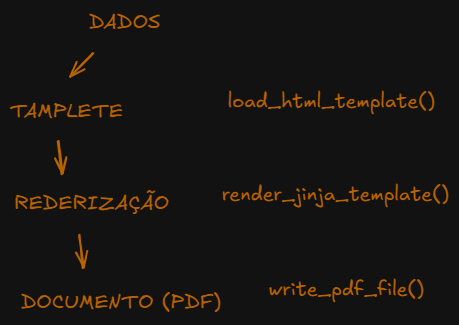

# weasyprint_lab

Uma breve demonstração da **Renderização** de PDFs usando Python, Jinja2 e **WeasyPrint**

O projeto explora um fluxo simples para gerar modelos HTML com o Jinja2 e convertê-los em documentos PDF usando o WeasyPrint.

#### O Problema:

Tive um grande problema com o **ReportLab**, dando manutenção em alguns relatórios em PDF gerados com ele.
Sua sintaxe e comportamento são muitos extranhos, depois de tanto tentar fui em busca de uma solução mais simples: **Renderizar PDFS**.

---

Em soluções como o **ReportLab** o **PDF** é montado linha a linha como um lego. Agora, na renderização só precisamos de um **HTML** para ser convertido.


>  Isso é exatamente o que acontece quanto salvamos uma página da WEB em PDF pelo seu Browser. O Famoso: **CTRL + P**

### STACK
- Python
- UV
- Jinja2
- WeasyPrint
- Flask
- Rich CLI
### SETUP
`sync dependecies:`
```bash
    uv sync
```
`run script:`
```bash
    uv run main.py
```
`run tests:`
```bash
    uv run pytest
```
```bash
    pytest
```

---

### Fluxo/Comportamento

O **fluxo** de execução e também de pensamento do código seria basicamente esse:

1. DADOS
2. TEMPLATE: 
    - Um arquivo HTML com as marcações do `Jinja`
3. RENDERIZAÇÃO: 
    - Passamos os dados para o Jinja, ele vai substituir em suas marcações e retornar uma string com o HTML completo
4. DOCUMENTO(PDF): 
    - Usamos a String de HTML para criar um PDF usando o `WeasyPrint`



### NOTAS

Os testes estão evoluindo gradualmente. Primeiro escrevi funções básicas para carregar e criar os arquivos. Agora temos uma função para deletar esses arquivos gerados (`delete_files`), evitando o acumulo desnecessário.

---
**Conceito Importante:** 

Esses tipos de testes devem evitar operações com **I/O** em excesso ou de alguma forma mascarar esse comportamento, pois em um cenário hipotético onde podemos ter centenas de testes, aqui é onde surgiria um grande gargalo. Testes unitários precisão ser rápidos para fazer sentido existirem.


Melhorando os erros no terminal:

[pytest.toml](pytest.toml) Podemos adicionar alguns argumentos que antes teriamos que passar diretamente na CLI, assim nosso output fica mais detalhado.


### TODO
- [] Separar/distinguir exatamente os testes de unidade e integração (unit x feature)
- [] Adicionar ao fluxo o upload dos arquivos em um Bucket GCS


Percerbendo o escopo dos testes até então, todos eles sé comportam como testes de feature e não sei se vamos conseguir ter algo que se aproxime de um teste de unidade ou função pura.
